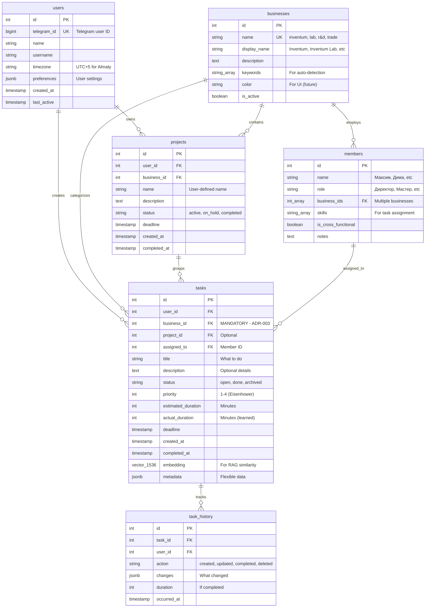

# Entity-Relationship Diagram - Business Planner

> **Database schema visualization**  
> **Created**: 2025-10-17  
> **Database**: PostgreSQL 15 + pgvector

---

## 🗂️ Entity-Relationship Diagram


```mermaid
erDiagram
    users ||--o{ tasks : creates
    users ||--o{ projects : owns
    businesses ||--o{ tasks : categorizes
    businesses ||--o{ projects : contains
    businesses ||--o{ members : employs
    projects ||--o{ tasks : groups
    members ||--o{ tasks : assigned_to
    tasks ||--o{ task_history : tracks
    
    users {
        int id PK
        bigint telegram_id UK "Telegram user ID"
        string name
        string username
        string timezone "UTC+5 for Almaty"
        jsonb preferences "User settings"
        timestamp created_at
        timestamp last_active
    }
    
    businesses {
        int id PK
        string name UK "inventum, lab, r&d, trade"
        string display_name "Inventum, Inventum Lab, etc"
        text description
        string_array keywords "For auto-detection"
        string color "For UI (future)"
        boolean is_active
    }
    
    members {
        int id PK
        string name "Максим, Дима, etc"
        string role "Директор, Мастер, etc"
        int_array business_ids FK "Multiple businesses"
        string_array skills "For task assignment"
        boolean is_cross_functional
        text notes
    }
    
    projects {
        int id PK
        int user_id FK
        int business_id FK
        string name "User-defined name"
        text description
        string status "active, on_hold, completed"
        timestamp deadline
        timestamp created_at
        timestamp completed_at
    }
    
    tasks {
        int id PK
        int user_id FK
        int business_id FK "MANDATORY - ADR-003"
        int project_id FK "Optional"
        int assigned_to FK "Member ID"
        string title "What to do"
        text description "Optional details"
        string status "open, done, archived"
        int priority "1-4 (Eisenhower)"
        int estimated_duration "Minutes"
        int actual_duration "Minutes (learned)"
        timestamp deadline
        timestamp created_at
        timestamp completed_at
        vector_1536 embedding "For RAG similarity"
        jsonb metadata "Flexible data"
    }
    
    task_history {
        int id PK
        int task_id FK
        int user_id FK
        string action "created, updated, completed, deleted"
        jsonb changes "What changed"
        int duration "If completed"
        timestamp occurred_at
    }
```

---

## 📊 Entity Descriptions

### Core Entities

#### users
**Purpose**: Telegram users of the system  
**Cardinality**: One (Константин) initially, can add more  
**Key Fields**:
- `telegram_id` - Unique Telegram user identifier
- `timezone` - For deadline calculation (UTC+5)
- `preferences` - User-specific settings (JSON)

---

#### businesses  
**Purpose**: The 4 business contexts  
**Cardinality**: Fixed 4 (Inventum, Lab, R&D, Trade)  
**Key Fields**:
- `name` - Internal identifier ("inventum", "lab", "r&d", "trade")
- `keywords` - For AI auto-detection (ARRAY of strings)
- **Critical**: Used for business isolation (ADR-003)

---

#### members
**Purpose**: Team members (8 people)  
**Cardinality**: 8 initially  
**Key Fields**:
- `business_ids` - ARRAY of business IDs (supports cross-functional)
- `skills` - For smart task assignment
- `is_cross_functional` - Flag for Максим, Дима

**Examples**:
```sql
-- Константин (CEO, all businesses)
INSERT INTO members VALUES (1, 'Константин', 'CEO', ARRAY[1,2,3,4], ARRAY['management'], false);

-- Максим (Inventum + R&D)
INSERT INTO members VALUES (2, 'Максим', 'Директор', ARRAY[1,3], ARRAY['management','diagnostics'], true);

-- Мария (Lab only)
INSERT INTO members VALUES (6, 'Мария', 'CAD/CAM оператор', ARRAY[2], ARRAY['cad','cam'], false);
```

---

#### projects
**Purpose**: User-created task groupings  
**Cardinality**: User-created (optional)  
**Key Fields**:
- `business_id` - Projects belong to one business
- `status` - Active, on hold, completed
- **Not auto-created** - User explicitly creates

---

#### tasks ⭐
**Purpose**: Main entity - user tasks  
**Cardinality**: ~500/month = ~6,000/year  
**Key Fields**:
- `business_id` - **MANDATORY** (ADR-003 isolation)
- `embedding` - vector(1536) for RAG (ADR-004)
- `estimated_duration` - AI prediction
- `actual_duration` - For learning
- `priority` - 1-4 (Eisenhower matrix)

**Critical**: This is the core entity, most frequently accessed

---

#### task_history
**Purpose**: Audit trail and analytics  
**Cardinality**: 5x tasks (multiple events per task)  
**Key Fields**:
- `action` - What happened (created, updated, completed)
- `changes` - JSON diff of changes
- `duration` - Actual duration if completed

**Used for**: Learning, analytics, undo functionality

---

## 🔗 Relationships

### One-to-Many

**users → tasks** (1:N)
- One user creates many tasks
- User (Константин) owns all tasks

**businesses → tasks** (1:N)  
- One business has many tasks
- **Mandatory relationship** (ADR-003)

**projects → tasks** (1:N)
- One project groups many tasks
- **Optional relationship** (project_id can be NULL)

**members → tasks** (1:N)
- One member can be assigned to many tasks
- **Optional relationship** (assigned_to can be NULL)

### Many-to-Many

**members ↔ businesses**
- Implemented via `business_ids` ARRAY in members table
- Members can work in multiple businesses
- Example: Максим works in Inventum (1) and R&D (3)

---

## 🔍 Key Constraints

### Business Isolation (ADR-003)
```sql
-- MANDATORY business_id
ALTER TABLE tasks 
    ALTER COLUMN business_id SET NOT NULL;

-- Valid business check
ALTER TABLE tasks
    ADD CONSTRAINT valid_business_id
    CHECK (business_id IN (1, 2, 3, 4));

-- Foreign key
ALTER TABLE tasks
    ADD CONSTRAINT fk_business
    FOREIGN KEY (business_id) 
    REFERENCES businesses(id)
    ON DELETE RESTRICT;
```

### Data Integrity
```sql
-- Priority range
ALTER TABLE tasks
    ADD CONSTRAINT valid_priority
    CHECK (priority BETWEEN 1 AND 4);

-- Status values
ALTER TABLE tasks
    ADD CONSTRAINT valid_status
    CHECK (status IN ('open', 'done', 'archived'));

-- Duration values (1 min to 8 hours)
ALTER TABLE tasks
    ADD CONSTRAINT valid_duration
    CHECK (
        (estimated_duration IS NULL OR estimated_duration BETWEEN 1 AND 480)
        AND
        (actual_duration IS NULL OR actual_duration BETWEEN 1 AND 480)
    );
```

---

## 📈 Cardinality Estimates

### Year 1 (500 tasks/month)

| Table | Rows | Growth/Month | Storage |
|-------|------|--------------|---------|
| **users** | 1 | 0 | < 1 KB |
| **businesses** | 4 | 0 (fixed) | < 1 KB |
| **members** | 8 | ~0 | < 5 KB |
| **projects** | ~20 | +2 | ~50 KB |
| **tasks** | 6,000 | +500 | ~60 MB |
| **task_history** | 30,000 | +2,500 | ~150 MB |

**Total Year 1**: ~210 MB (fits easily in 25 GB Droplet) ✅

### Year 3 (1000 tasks/month)

| Table | Rows | Storage |
|-------|------|---------|
| **tasks** | 36,000 | ~360 MB |
| **task_history** | 180,000 | ~900 MB |
| **Total** | - | **~1.3 GB** |

**Still fits comfortably in 25 GB Droplet** ✅

---

## 🎯 Access Patterns

### Most Common Queries

#### 1. Get Today's Tasks (by business)
```sql
-- Used by /today command
SELECT * FROM tasks
WHERE user_id = $1
  AND business_id = $2
  AND status = 'open'
  AND deadline::date = CURRENT_DATE
ORDER BY priority ASC, deadline ASC;

-- Index needed: (user_id, business_id, status, deadline)
```

#### 2. Vector Similarity Search
```sql
-- Used by RAG time estimation (ADR-004)
SELECT 
    id, title, actual_duration,
    1 - (embedding <=> $1) as similarity
FROM tasks
WHERE business_id = $2
  AND embedding IS NOT NULL
  AND actual_duration IS NOT NULL
  AND 1 - (embedding <=> $1) >= $3
ORDER BY embedding <=> $1
LIMIT 5;

-- Index needed: HNSW on embedding
```

#### 3. List Projects by Business
```sql
-- Used by /projects command
SELECT * FROM projects
WHERE user_id = $1
  AND business_id = $2
  AND status = 'active'
ORDER BY created_at DESC;

-- Index needed: (user_id, business_id, status)
```

#### 4. Weekly Analytics
```sql
-- Get completed tasks for week
SELECT 
    business_id,
    COUNT(*) as tasks_completed,
    SUM(actual_duration) as total_time,
    AVG(actual_duration) as avg_time
FROM tasks
WHERE user_id = $1
  AND completed_at >= NOW() - INTERVAL '7 days'
  AND status = 'done'
GROUP BY business_id;

-- Index needed: (user_id, completed_at, status)
```

---

## 💾 Storage Estimates

### Per Task
```
Task row (without embedding): ~500 bytes
Embedding (1536 floats × 4 bytes): 6,144 bytes
Total per task: ~6.6 KB
```

### Scaling
```
1,000 tasks: ~6.6 MB
10,000 tasks: ~66 MB
100,000 tasks: ~660 MB
```

**Our scale** (6,000 tasks/year): ~40 MB ✅

---

## 🔄 Migration Strategy

### Initial Migration
```sql
-- V001: Initial schema
-- Creates: users, businesses, members, projects, tasks, task_history
-- Enables: pgvector extension
-- Creates: All indexes
```

### Future Migrations
```sql
-- V002: Add analytics tables (if needed)
-- V003: Add recurring tasks (if needed)
-- V004: Add notifications (if needed)
```

**Tool**: Alembic for version control

---

## 📝 Next Steps

Based on this ER diagram, we'll create:

1. ✅ **Complete SQL schema** (`docs/02-database/schema.sql`)
2. **Indexes specification** (`docs/02-database/indexes.md`)
3. **Seed data** (`docs/02-database/seed-data.sql`)
4. **Migration plan** (`docs/02-database/migrations/`)

---

**Status**: ✅ ER Diagram Complete  
**Next**: Create complete SQL schema  
**Reference**: See docs/TEAM.md for team structure, ADR-003 for business isolation

