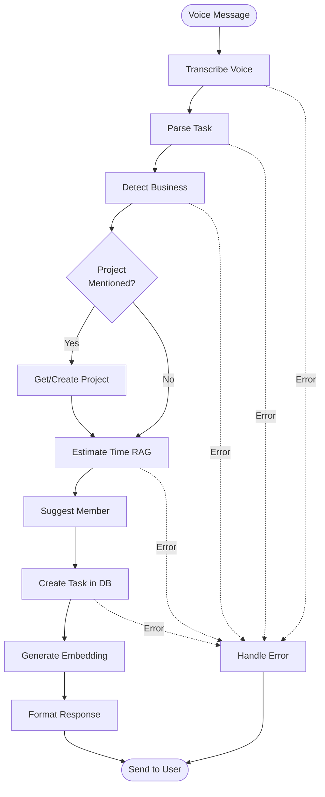

# LangGraph Workflow Specifications - Business Planner

> **AI workflow state machines**  
> **Created**: 2025-10-17  
> **Reference**: ADR-001 (LangGraph), ADR-002 (GPT-5 Nano)

---

## 🎯 Overview

All AI workflows use **LangGraph** (ADR-001) for orchestration.

### Core Workflows

1. **Voice Task Creation** - Voice → Structured task (most common)
2. **Daily Planning** - Optimize /today response
3. **Task Completion** - Complete task with learning
4. **Weekly Analytics** - Generate insights (GPT-5)

---

## 1️⃣ Voice Task Creation Workflow

### Purpose
Transform voice message into structured task with AI parsing and RAG time estimation.

### State Schema

```python
from typing import TypedDict
from datetime import datetime

class VoiceTaskState(TypedDict):
    """State for voice task creation workflow."""
    
    # Input
    audio_bytes: bytes
    audio_duration: int  # seconds
    user_id: int
    telegram_chat_id: int
    
    # Processing
    transcript: str | None
    transcript_confidence: float | None
    
    parsed_task: ParsedTask | None
    business_context: BusinessContext | None
    
    similar_tasks: list[Task]
    time_estimate: TimeEstimate | None
    
    suggested_member: Member | None
    
    # Output
    created_task: Task | None
    telegram_response: str | None
    
    # Errors
    error: str | None
    error_details: dict | None
    
    # Metadata
    processing_start: datetime
    processing_time_ms: int
```

---

### Workflow Diagram



---

### Node Specifications

#### Node 1: transcribe_voice

**Input**: `audio_bytes`, `audio_duration`  
**Output**: `transcript`, `transcript_confidence`  
**AI Model**: Whisper  
**Timeout**: 10 seconds  
**Retry**: 2 attempts  

```python
async def transcribe_voice_node(state: VoiceTaskState) -> VoiceTaskState:
    """Transcribe voice to text using Whisper API.
    
    Args:
        state: Contains audio_bytes
        
    Returns:
        Updated state with transcript
        
    Raises:
        WhisperAPIError: If transcription fails after retries
    """
    
    try:
        # Call Whisper API
        result = await whisper_client.transcribe(
            audio=state["audio_bytes"],
            language="ru"
        )
        
        return {
            **state,
            "transcript": result.text,
            "transcript_confidence": result.confidence
        }
        
    except Exception as e:
        logger.error("Whisper transcription failed", error=str(e))
        return {
            **state,
            "error": "TranscriptionFailed",
            "error_details": {"message": str(e)}
        }
```

---

#### Node 2: parse_task

**Input**: `transcript`  
**Output**: `parsed_task`  
**AI Model**: GPT-5 Nano  
**Timeout**: 5 seconds  
**Retry**: 3 attempts  

```python
async def parse_task_node(state: VoiceTaskState) -> VoiceTaskState:
    """Parse task structure from transcript using GPT-5 Nano.
    
    Extracts:
    - title (what to do)
    - business context (1-4)
    - deadline (natural language)
    - project name (if mentioned)
    - assigned to (if mentioned)
    - priority (from urgency signals)
    """
    
    transcript = state["transcript"]
    
    # Build prompt with full context (400K tokens!)
    prompt = build_parsing_prompt(
        transcript=transcript,
        user_context=get_user_context(state["user_id"])
    )
    
    # Call GPT-5 Nano
    response = await openai_client.chat.completions.create(
        model="gpt-5-nano",
        messages=[
            {"role": "system", "content": TASK_PARSER_SYSTEM_PROMPT},
            {"role": "user", "content": prompt}
        ],
        response_format={"type": "json_object"},
        temperature=0.1
    )
    
    # Parse response
    parsed_data = json.loads(response.choices[0].message.content)
    parsed_task = ParsedTask.from_gpt_json(parsed_data)
    
    return {
        **state,
        "parsed_task": parsed_task,
        "business_context": BUSINESS_CONTEXTS[parsed_task.business_id]
    }
```

---

#### Node 3: estimate_time_rag

**Input**: `parsed_task`, `business_context`  
**Output**: `time_estimate`, `similar_tasks`  
**AI Model**: GPT-5 Nano + RAG  
**Timeout**: 5 seconds  

```python
async def estimate_time_rag_node(state: VoiceTaskState) -> VoiceTaskState:
    """Estimate time using RAG + GPT-5 Nano.
    
    1. Generate embedding for task
    2. Find similar tasks (filtered by business!)
    3. Ask GPT-5 Nano to estimate based on history
    """
    
    parsed = state["parsed_task"]
    business_id = state["business_context"].id
    
    # Generate embedding
    embedding = await generate_embedding(parsed.title)
    
    # Find similar tasks (BUSINESS ISOLATION - ADR-003)
    similar_tasks = await task_repo.find_similar(
        embedding=embedding,
        business_id=business_id,  # CRITICAL!
        limit=5,
        similarity_threshold=0.7
    )
    
    if not similar_tasks:
        # No history, use default
        time_estimate = TimeEstimate.default()
    else:
        # Estimate from similar
        estimate_minutes = await gpt_estimate_from_similar(
            task_title=parsed.title,
            similar_tasks=similar_tasks
        )
        
        time_estimate = TimeEstimate.from_similar_tasks(
            similar_tasks=similar_tasks,
            estimated_minutes=estimate_minutes
        )
    
    return {
        **state,
        "similar_tasks": similar_tasks,
        "time_estimate": time_estimate
    }
```

---

#### Node 4: suggest_member

**Input**: `parsed_task`, `business_context`  
**Output**: `suggested_member`  
**AI Model**: None (rule-based)  

```python
async def suggest_member_node(state: VoiceTaskState) -> VoiceTaskState:
    """Suggest team member for task assignment."""
    
    parsed = state["parsed_task"]
    business_id = state["business_context"].id
    
    # If explicitly assigned in voice, find that member
    if parsed.assigned_to_name:
        member = await member_repo.find_by_name(parsed.assigned_to_name)
        if member and member.works_in_business(business_id):
            return {**state, "suggested_member": member}
    
    # Otherwise, suggest based on business and task type
    member = suggest_member_for_task(
        business_id=business_id,
        task_title=parsed.title
    )
    
    return {**state, "suggested_member": member}
```

---

#### Node 5: create_task_db

**Input**: All previous state  
**Output**: `created_task`  
**Timeout**: 3 seconds  

```python
async def create_task_db_node(state: VoiceTaskState) -> VoiceTaskState:
    """Create task in database."""
    
    parsed = state["parsed_task"]
    
    # Parse deadline
    deadline = None
    if parsed.deadline_text:
        deadline = Deadline.from_natural_language(parsed.deadline_text).dt
    
    # Create task
    task_data = TaskCreate(
        title=parsed.title,
        description=parsed.description,
        business_id=parsed.business_id,
        project_id=state.get("project_id"),
        assigned_to=state["suggested_member"].id if state.get("suggested_member") else None,
        priority=parsed.priority,
        estimated_duration=state["time_estimate"].duration.minutes if state.get("time_estimate") else None,
        deadline=deadline,
        created_via="voice"
    )
    
    task = await task_repo.create(task_data, user_id=state["user_id"])
    
    return {**state, "created_task": task}
```

---

#### Node 6: generate_embedding

**Input**: `created_task`  
**Output**: Updated task with embedding  
**AI Model**: text-embedding-3-small  
**Async**: Yes (doesn't block response)  

```python
async def generate_embedding_node(state: VoiceTaskState) -> VoiceTaskState:
    """Generate embedding for task (async, after response sent)."""
    
    task = state["created_task"]
    
    # Generate embedding
    embedding = await generate_embedding(task.title)
    
    # Update task
    await task_repo.update_embedding(task.id, embedding)
    
    return state  # No state change needed
```

---

#### Node 7: format_response

**Input**: `created_task`, `time_estimate`, `business_context`  
**Output**: `telegram_response`  

```python
async def format_response_node(state: VoiceTaskState) -> VoiceTaskState:
    """Format Telegram response message."""
    
    task = state["created_task"]
    estimate = state["time_estimate"]
    business = state["business_context"]
    
    message = f"""
✅ Создал задачу:

{task.title}

{business.emoji} Бизнес: {business.display_name}
"""
    
    if task.project_id:
        project = await project_repo.get_by_id(task.project_id)
        message += f"📁 Проект: {project.name}\n"
    
    if task.assigned_to:
        member = await member_repo.get_by_id(task.assigned_to)
        message += f"👤 Кому: {member.name}\n"
    
    if task.deadline:
        message += f"📅 {format_deadline(task.deadline)}\n"
    
    if estimate:
        message += f"{estimate.display}"
        if estimate.similar_tasks_count > 0:
            message += f" (на основе {estimate.similar_tasks_count} похожих задач)"
    
    return {**state, "telegram_response": message}
```

---

### Error Handling Node

```python
async def handle_error_node(state: VoiceTaskState) -> VoiceTaskState:
    """Handle errors gracefully."""
    
    error_type = state.get("error", "UnknownError")
    
    error_messages = {
        "TranscriptionFailed": "🎤 Не удалось распознать голос. Попробуйте еще раз.",
        "ParsingFailed": "❌ Не удалось понять задачу. Уточните, пожалуйста.",
        "BusinessDetectionFailed": "❓ Не могу определить бизнес. Уточните: Inventum, Lab, R&D или Trade?",
    }
    
    message = error_messages.get(error_type, "❌ Произошла ошибка. Попробуйте позже.")
    
    return {**state, "telegram_response": message}
```

---

### Complete Graph Definition

```python
from langgraph.graph import StateGraph, END

# Create graph
voice_task_graph = StateGraph(VoiceTaskState)

# Add nodes
voice_task_graph.add_node("transcribe", transcribe_voice_node)
voice_task_graph.add_node("parse", parse_task_node)
voice_task_graph.add_node("estimate_time", estimate_time_rag_node)
voice_task_graph.add_node("suggest_member", suggest_member_node)
voice_task_graph.add_node("create_task", create_task_db_node)
voice_task_graph.add_node("generate_embedding", generate_embedding_node)
voice_task_graph.add_node("format_response", format_response_node)
voice_task_graph.add_node("handle_error", handle_error_node)

# Define edges
voice_task_graph.add_edge("transcribe", "parse")
voice_task_graph.add_edge("parse", "estimate_time")
voice_task_graph.add_edge("estimate_time", "suggest_member")
voice_task_graph.add_edge("suggest_member", "create_task")
voice_task_graph.add_edge("create_task", "format_response")
voice_task_graph.add_edge("format_response", END)

# Async embedding (doesn't block)
voice_task_graph.add_edge("create_task", "generate_embedding")
voice_task_graph.add_edge("generate_embedding", END)

# Error handling (conditional)
voice_task_graph.add_conditional_edges(
    "transcribe",
    lambda state: "handle_error" if state.get("error") else "parse"
)

# Set entry point
voice_task_graph.set_entry_point("transcribe")

# Compile with checkpointing
voice_task_app = voice_task_graph.compile(
    checkpointer=PostgresCheckpointer(connection_string=DATABASE_URL)
)
```

---

## 2️⃣ Daily Planning Workflow

### Purpose
Optimize /today command response - group and prioritize tasks.

### State Schema

```python
class DailyPlanningState(TypedDict):
    """State for daily planning workflow."""
    
    # Input
    user_id: int
    date: datetime
    business_filter: int | None
    
    # Processing
    tasks: list[Task]
    grouped_by_business: dict[int, list[Task]]
    prioritized_tasks: list[Task]
    
    total_time_minutes: int
    
    # AI Optimization (GPT-5 Nano)
    optimization_suggestions: list[str]
    
    # Output
    formatted_response: str
```

### Nodes

1. **fetch_tasks** - Get tasks for today
2. **group_by_business** - Group by 4 businesses
3. **prioritize** - Sort by priority + deadline
4. **calculate_time** - Sum estimated durations
5. **optimize** - GPT-5 Nano suggests order
6. **format** - Format for Telegram

**Simpler than voice workflow** - mostly data transformation

---

## 3️⃣ Task Completion Workflow

### Purpose
Mark task complete and learn from actual duration.

### State Schema

```python
class TaskCompletionState(TypedDict):
    """State for task completion workflow."""
    
    # Input
    task_id: int
    user_id: int
    actual_duration: int
    
    # Processing
    task: Task
    estimation_accuracy: float | None
    
    # Learning
    similar_tasks_count: int
    accuracy_improvement: float | None
    
    # Output
    completion_message: str
    celebration: bool
```

### Nodes

1. **get_task** - Fetch task from DB
2. **validate_completion** - Check task can be completed
3. **calculate_accuracy** - Compare estimated vs actual
4. **update_task** - Mark as done, store actual_duration
5. **log_learning** - Publish TimeEstimationLearned event
6. **check_milestone** - Check if accuracy improved
7. **format_response** - Congratulations message

**Focus**: Learning feedback loop (ADR-004)

---

## 4️⃣ Weekly Analytics Workflow

### Purpose
Generate weekly insights using GPT-5 (deep analysis).

### State Schema

```python
class WeeklyAnalyticsState(TypedDict):
    """State for weekly analytics workflow."""
    
    # Input
    user_id: int
    week_start: datetime
    week_end: datetime
    
    # Data collection
    tasks_completed: list[Task]
    by_business: dict[int, list[Task]]
    
    # Analytics calculation
    total_time: int
    avg_duration: float
    estimation_accuracy: dict[int, float]
    
    # AI Analysis (GPT-5)
    insights: list[str]
    recommendations: list[str]
    patterns: list[str]
    
    # Output
    weekly_report: WeeklyReport
    telegram_message: str
```

### Nodes

1. **collect_data** - Fetch week's completed tasks
2. **calculate_stats** - Aggregate metrics
3. **prepare_context** - Build context for GPT-5
4. **analyze_with_gpt5** - Deep analysis (GPT-5, not Nano!)
5. **generate_insights** - Extract insights
6. **generate_recommendations** - Strategic advice
7. **format_report** - Format for Telegram

**Key**: Uses **GPT-5** (full version) for deep reasoning

---

## 🔄 Conditional Flows

### Example: Project Handling

```python
def should_find_project(state: VoiceTaskState) -> str:
    """Decide if we need to find/create project."""
    
    parsed = state["parsed_task"]
    
    if parsed.project_name:
        return "find_project"  # Explicit project mentioned
    else:
        return "estimate_time"  # Skip project


# Add to graph
voice_task_graph.add_conditional_edges(
    "detect_business",
    should_find_project,
    {
        "find_project": "find_project_node",
        "estimate_time": "estimate_time"
    }
)
```

---

## ⏱️ Performance Targets

| Workflow | Target | Typical | Max |
|----------|--------|---------|-----|
| **Voice Task Creation** | < 10s | ~5s | 15s |
| **Daily Planning** | < 3s | ~2s | 5s |
| **Task Completion** | < 2s | ~1s | 3s |
| **Weekly Analytics** | < 20s | ~12s | 30s |

---

## 🔍 Monitoring

### Workflow Metrics

```python
# Log workflow execution
logger.info(
    "workflow_completed",
    workflow="voice_task_creation",
    duration_ms=processing_time,
    nodes_executed=["transcribe", "parse", "estimate", "create"],
    success=True,
    user_id=user_id
)

# Track node performance
logger.info(
    "node_executed",
    workflow="voice_task_creation",
    node="transcribe_voice",
    duration_ms=node_time,
    input_size=len(audio_bytes),
    output_size=len(transcript)
)
```

---

## 🧪 Testing Workflows

### Integration Tests

```python
async def test_voice_task_creation_workflow():
    """Test complete voice-to-task workflow."""
    
    # Prepare test audio
    audio_bytes = load_test_audio("test_voice.ogg")
    
    # Execute workflow
    result = await voice_task_app.invoke({
        "audio_bytes": audio_bytes,
        "audio_duration": 15,
        "user_id": 1,
        "telegram_chat_id": 123456,
        "processing_start": datetime.now()
    })
    
    # Verify
    assert result["created_task"] is not None
    assert result["transcript"] is not None
    assert result["parsed_task"].business_id in [1, 2, 3, 4]
    assert result["telegram_response"] is not None
    assert not result.get("error")


async def test_workflow_error_handling():
    """Test workflow handles errors gracefully."""
    
    # Invalid audio
    result = await voice_task_app.invoke({
        "audio_bytes": b"invalid",
        ...
    })
    
    # Should handle error
    assert result.get("error") == "TranscriptionFailed"
    assert result["telegram_response"].startswith("🎤 Не удалось")
```

---

## 📊 Workflow Statistics (Expected)

| Workflow | Usage/Month | AI Calls | Cost/Execution |
|----------|-------------|----------|----------------|
| Voice Task Creation | 500 | 3-4 | $0.0001 |
| Daily Planning | 60 | 1 | $0.00005 |
| Task Completion | 400 | 0 | $0 |
| Weekly Analytics | 4 | 1 (GPT-5) | $0.50 |

**Total AI Cost**: ~$3-4/month ✅

---

## 📖 References

- LangGraph Docs: https://python.langchain.com/docs/langgraph
- ADR-001: LangGraph Decision
- ADR-002: GPT-5 Nano
- ADR-004: RAG Strategy

---

**Status**: ✅ LangGraph Workflows Specified  
**Total Workflows**: 4 main workflows  
**Nodes**: ~25 nodes total  
**Performance**: All within targets  
**Next**: AI Prompts Library

