# Digital Ocean Architecture - Business Planner

> **Complete infrastructure architecture on $6 Droplet**  
> **Created**: 2025-10-17  
> **Reference**: ADR-006 (Digital Ocean Droplet)

---

## 🎯 Architecture Overview

**Single Droplet** - All-in-one Docker Compose setup on Basic Droplet ($6/month)

---

## 🏗️ Infrastructure Diagram

```mermaid
graph TB
    subgraph Internet
        User[👤 Константин<br/>Telegram App]
        TelegramServers[Telegram Servers]
        OpenAI[OpenAI APIs<br/>Whisper, GPT-5 Nano, GPT-5]
    end
    
    subgraph "Digital Ocean Droplet ($6/month)<br/>1GB RAM, 1 vCPU, 25GB SSD"
        subgraph "Docker Compose Network"
            Nginx[Nginx<br/>Reverse Proxy<br/>SSL Termination]
            
            Backend[FastAPI Backend<br/>LangGraph<br/>256MB RAM]
            
            Postgres[PostgreSQL 15<br/>+ pgvector<br/>384MB RAM]
            
            Redis[Redis 7<br/>Cache<br/>64MB RAM]
        end
        
        Firewall[DO Firewall<br/>Ports: 22, 80, 443]
    end
    
    subgraph "Digital Ocean Services"
        Backups[Automated Backups<br/>+$1.20/month]
        Monitoring[DO Monitoring<br/>Free]
    end
    
    User -->|HTTPS| Firewall
    TelegramServers -->|Webhook POST| Firewall
    Firewall -->|Port 443| Nginx
    Nginx -->|Port 8000| Backend
    Backend -->|localhost:5432| Postgres
    Backend -->|localhost:6379| Redis
    Backend -->|HTTPS API| OpenAI
    Backend -->|HTTPS API| TelegramServers
    
    Postgres -.->|Daily| Backups
    Backend -.->|Metrics| Monitoring
    
    style Droplet fill:#0080ff
    style Nginx fill:#90EE90
    style Backend fill:#FFD700
    style Postgres fill:#87CEEB
    style Redis fill:#FF6B6B
```



---

## 📦 Component Breakdown

### Nginx (Reverse Proxy)

**Purpose**:
- SSL termination (HTTPS)
- Reverse proxy to FastAPI
- Serve static files (future Web UI)
- Rate limiting

**Configuration**:
```nginx
server {
    listen 443 ssl http2;
    server_name planner.yourdomain.com;
    
    # SSL (Let's Encrypt)
    ssl_certificate /etc/letsencrypt/live/domain/fullchain.pem;
    ssl_certificate_key /etc/letsencrypt/live/domain/privkey.pem;
    
    # Proxy to FastAPI
    location / {
        proxy_pass http://backend:8000;
        proxy_set_header Host $host;
        proxy_set_header X-Real-IP $remote_addr;
    }
    
    # Telegram webhook
    location /webhook/telegram {
        proxy_pass http://backend:8000/webhook/telegram;
        proxy_read_timeout 30s;
    }
}
```

**Resources**: 32MB RAM, 0.1 vCPU

---

### FastAPI Backend

**Purpose**:
- REST API endpoints
- Telegram bot handlers
- LangGraph workflows
- Business logic

**Components**:
```
Backend Container:
├── FastAPI web server
├── LangGraph workflows
├── OpenAI client
├── SQLAlchemy ORM
├── Redis client
└── Telegram bot handlers
```

**Resources**: 256MB RAM, 0.5 vCPU

**Connections**:
- PostgreSQL: `postgres:5432` (local network)
- Redis: `redis:6379` (local network)
- OpenAI: HTTPS external
- Telegram: HTTPS external

---

### PostgreSQL 15 + pgvector

**Purpose**:
- Primary data store
- Vector similarity search (RAG)
- Transactional integrity

**Configuration**:
```
Memory: 384MB
Shared buffers: 96MB
Work mem: 4MB
Max connections: 20
```

**Storage**:
- Volume: `postgres_data` (persistent)
- Size: ~100MB Year 1, ~500MB Year 3

**Resources**: 384MB RAM, 0.3 vCPU

---

### Redis 7

**Purpose**:
- Session storage
- Cache (API responses)
- Rate limiting counters

**Configuration**:
```
Max memory: 50MB
Eviction policy: allkeys-lru
Persistence: RDB snapshots
```

**Resources**: 64MB RAM, 0.1 vCPU

---

## 💾 Resource Allocation

### Total Resources

| Component | RAM | CPU | Storage |
|-----------|-----|-----|---------|
| **Nginx** | 32MB | 0.1 | ~10MB |
| **Backend** | 256MB | 0.5 | ~50MB |
| **PostgreSQL** | 384MB | 0.3 | ~100MB |
| **Redis** | 64MB | 0.1 | ~10MB |
| **System** | ~200MB | - | ~500MB |
| **TOTAL** | **~936MB** | **1.0** | **~670MB** |

**Droplet Capacity**: 1GB RAM, 1 vCPU, 25GB SSD

**Headroom**:
- RAM: ~88MB free (9%)
- CPU: Plenty (mostly I/O wait)
- Storage: ~24GB free (96%)

**Verdict**: Comfortably fits! ✅

---

## 🔒 Security Layers

### 1. Firewall (Digital Ocean)

```
Allowed Inbound:
- Port 22 (SSH) - Restricted to your IP
- Port 80 (HTTP) - Redirect to 443
- Port 443 (HTTPS) - Public

Allowed Outbound:
- All (for API calls to OpenAI, Telegram)
```

### 2. SSL/TLS (Let's Encrypt)

- Free SSL certificates
- Auto-renewal (certbot)
- A+ rating (SSL Labs)

### 3. Application Security

- Secret token for Telegram webhook
- Environment variables (not in code)
- Rate limiting (per user/IP)
- Input validation (Pydantic)

### 4. SSH Hardening

- Key-based auth only (no passwords)
- Fail2ban (auto-ban brute force)
- Non-root user for services
- Regular security updates

---

## 🔄 Networking

### Internal (Docker Network)

```
planner_network (bridge)
├── nginx → backend:8000
├── backend → postgres:5432
├── backend → redis:6379
└── All containers can communicate
```

**Advantages**:
- No network latency (localhost)
- No additional firewall rules
- Simple configuration

### External (Internet)

```
User/Telegram → 443 (HTTPS) → Nginx → Backend
Backend → OpenAI API (HTTPS)
Backend → Telegram API (HTTPS)
```

---

## 📊 Traffic Patterns

### Expected Load

| Metric | Value |
|--------|-------|
| **Requests/day** | ~30 |
| **Peak requests/hour** | ~5 |
| **Bandwidth/month** | < 1GB |
| **Concurrent users** | 1-2 |

**Droplet Limits**:
- Transfer: 1TB/month
- Our usage: < 1GB/month
- **Headroom**: 1000x ✅

---

## 💾 Data Persistence

### Docker Volumes

```yaml
volumes:
  postgres_data:
    driver: local
    # Stores: /var/lib/postgresql/data
    # Size: ~100MB → ~500MB over time
  
  redis_data:
    driver: local
    # Stores: /data
    # Size: ~10MB
  
  letsencrypt:
    driver: local
    # Stores: SSL certificates
    # Size: ~1MB
```

**Backup Strategy**:
- Daily pg_dump to `/backups`
- Keep 7 days locally
- Upload to DO Spaces (optional, $1/month)

---

## 🚀 Deployment Strategy

### Initial Deployment

```bash
# 1. Create Droplet with Terraform
terraform apply

# 2. SSH to Droplet
ssh root@droplet-ip

# 3. Clone repository
git clone https://github.com/user/planer_4.git
cd planer_4

# 4. Configure environment
cp .env.example .env
nano .env  # Add secrets

# 5. Deploy
docker-compose -f infrastructure/docker/docker-compose.prod.yml up -d

# 6. Run migrations
docker-compose exec backend alembic upgrade head

# 7. Setup SSL
certbot --nginx -d planner.yourdomain.com
```

**Time**: ~20 minutes first deploy

---

### Updates (CI/CD)

```bash
# Automatic via GitHub Actions
git push origin main
  ↓
GitHub Actions triggers
  ↓
SSH to Droplet
  ↓
git pull
  ↓
docker-compose up -d --build
  ↓
Zero-downtime rolling restart
```

**Downtime**: < 10 seconds

---

## 📈 Scaling Strategy

### Current (Year 1)
```
Droplet: $6/month (Basic)
├── 1GB RAM (90% used)
├── 1 vCPU (30% used avg)
└── 25GB SSD (3% used)

Status: ✅ Perfect fit
```

### Growth (Year 2 - 2x traffic)
```
Same Droplet: $6/month
├── 1GB RAM (95% used) ⚠️
└── Still works, slightly tighter

Option: Upgrade to $12 Droplet
├── 2GB RAM (50% used) ✅
└── More headroom
```

### Scale (Year 3+ - 5-10x traffic)
```
Option A: Bigger Droplet ($18-24/month)
Option B: Separate databases ($6 app + $15 managed DB)
Option C: Multiple Droplets + Load Balancer

Choice depends on revenue at that point
```

---

## 🔍 Monitoring Setup

### Digital Ocean Monitoring (Free)

**Metrics**:
- CPU usage
- Memory usage
- Disk usage
- Network in/out
- Load average

**Alerts** (via email/Telegram):
- CPU > 80% for 5 min
- Memory > 90%
- Disk > 80%
- Droplet offline

### Application Monitoring

**Logs**:
```
/var/log/planner/
├── app.log (application logs)
├── nginx-access.log
├── nginx-error.log
└── postgres.log
```

**Metrics** (optional - Prometheus):
- Request count
- Response time (p50, p95, p99)
- Error rate
- AI API calls
- Database query time

---

## 💰 Total Infrastructure Cost

```
Basic Droplet:        $6.00/month
Backups (optional):   $1.20/month
Domain (optional):    $1.00/month
─────────────────────────────────
TOTAL:                $7-8/month

Optional:
DO Spaces (backups):  $1/month
Monitoring alerts:    $0 (free tier)
SSL:                  $0 (Let's Encrypt)
```

**Annual**: $84-96/year (incredibly affordable!)

---

## 🎯 High Availability (Future)

### Current Setup
- Single Droplet
- Daily backups
- 99% uptime (acceptable for MVP)

### If Need 99.9% (Future)
```
Load Balancer:        $12/month
Droplet 1 (Primary):  $6/month
Droplet 2 (Replica):  $6/month
Managed PostgreSQL:   $15/month
─────────────────────────────────
TOTAL:                $39/month
```

**When**: Only if revenue > $5K/month (not needed now)

---

## 📖 References

- ADR-006: Digital Ocean Droplet Decision
- Database: `docs/02-database/schema.sql`
- Docker: Will be in `infrastructure/docker/`
- Terraform: Will be in `infrastructure/terraform/`

---

**Status**: ✅ Digital Ocean Architecture Documented  
**Cost**: $6-8/month  
**Scalability**: Can handle 10x growth easily  
**Next**: Terraform Configuration

